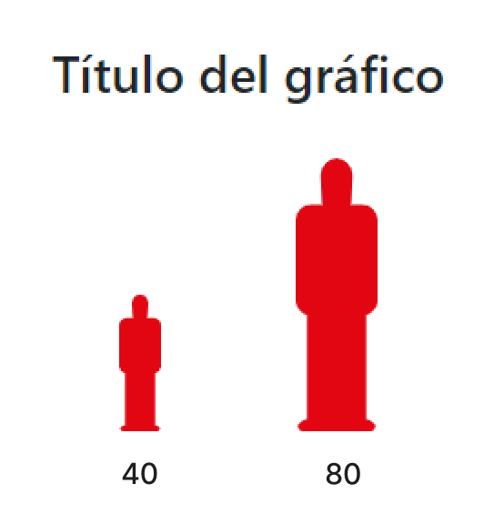
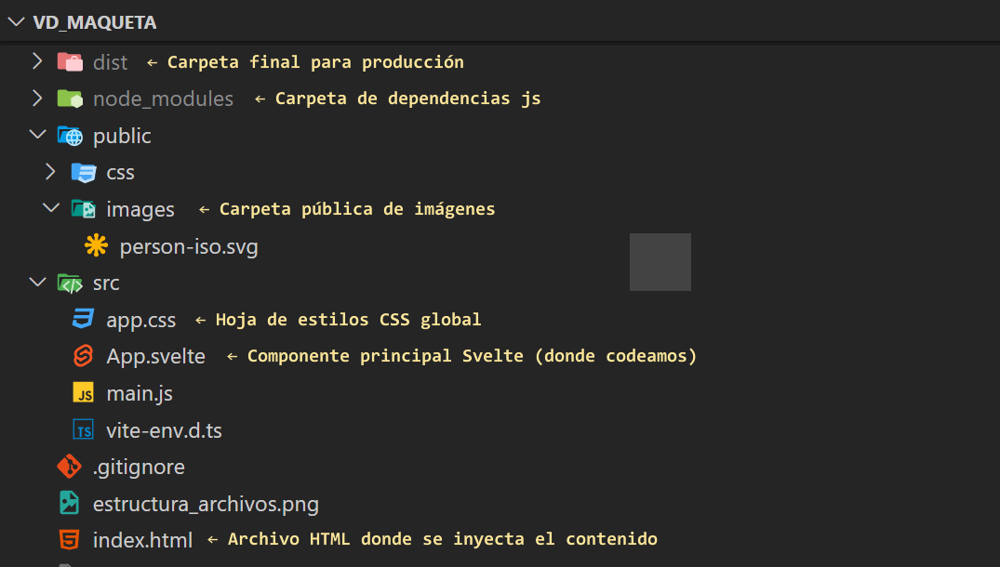

# VD | Maqueta inicial web (HTML, CSS, Svelte)

<!-- image .md -->


---

## Estructura de archivos:



## Requerimientos:

- [Node.js](https://nodejs.org/es/) version 18+ ó 20+

## Dependencias:
Ejecutar el siguiente comando para instalar las dependencias del proyecto:
```bash	
npm install
```

## Desarrollo:
Ejecutar el siguiente comando para iniciar el servidor de desarrollo que generará un servidor local y recargará el navegador automáticamente. Hacer click sobre la url que se muestra en la consola para abrir el navegador.

```bash	
npm run dev
```

## Build :
Ejecutar el siguiente comando para generar los archivos de producción (html, css, js y assets) en la carpeta `dist`:
```bash	
npm run dev
```